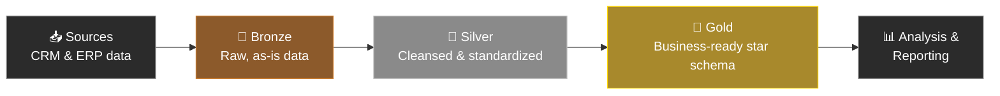
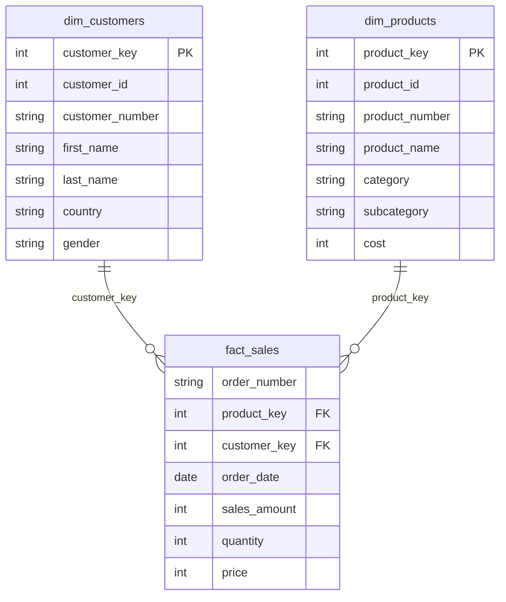

# 🏗️ SQL Data Warehouse Practice Project

<p align="center">
  
  
  
</p>

<p align="center">
  A hands-on practice project building a modern data warehouse from scratch with SQL Server — covering the full workflow from raw data to business-ready analytics.
</p>

---

## 📖 About

This project simulates a real-world data warehouse build using the **Medallion Architecture** (Bronze → Silver → Gold). It's a practice repo focused on developing production-style habits: layered transformations, data quality checks, and clean, documented SQL.

## 🎯 Goals

- Build a working data warehouse from scratch using SQL Server
- Practice ETL (Extract, Transform, Load) pipelines
- Apply data modeling concepts (star schema, fact/dimension tables)
- Write SQL queries for analysis and reporting

## 🏛️ Architecture

The warehouse follows the **Medallion Architecture**, with each layer serving a distinct purpose:



| Layer | Purpose |
|-------|---------|
| 🥉 **Bronze** | Raw data loaded as-is from source systems (CRM, ERP), no transformations applied |
| 🥈 **Silver** | Cleansed, standardized, and deduplicated data — ready for modeling |
| 🥇 **Gold** | Business-ready views modeled into a star schema for reporting and analysis |

### Gold Layer — Star Schema



## 🛠️ Tech Stack

- **SQL Server** — database engine
- **T-SQL** — DDL, views, stored procedures
- **SSMS** — development & query execution

## 📂 Repository Structure

```
sql-data-warehouse-practice-project/
│
├── datasets/                      # Source data files
│
├── documents/
│   └── data_catalog.md            # Data dictionary for the gold layer
│
├── scripts/
│   ├── bronze/
│   │   ├── ddl_bronze.sql         # Table definitions for the bronze layer
│   │   └── proc_load_bronze.sql   # Stored procedure to load bronze tables
│   │
│   ├── silver/
│   │   ├── ddl_silver.sql         # Table definitions for the silver layer
│   │   └── proc_load_silver.sql   # Stored procedure to clean & load silver tables
│   │
│   ├── gold/
│   │   └── ddl_gold.sql           # Star schema views (dimensions & fact)
│   │
│   └── init_database.sql          # Database & schema initialization
│
├── tests/
│   ├── quality_checks_silver.sql  # Data validation checks for the silver layer
│   └── quality_checks_gold.sql    # Data validation checks for the gold layer
│
├── LICENSE
└── README.md
```

## 🚀 Getting Started

1. Clone the repo
   ```bash
   git clone https://github.com/DrVillain/sql-data-warehouse-practice-project.git
   ```
2. Run `scripts/init_database.sql` to set up the database and schemas
3. Run the Bronze layer scripts to create and load raw tables
4. Run the Silver layer scripts to clean and standardize the data
5. Run `scripts/gold/ddl_gold.sql` to create the reporting views
6. Run the scripts in `tests/` to validate data quality at each layer

## 📊 Data Model

See [`documents/data_catalog.md`](documents/data_catalog.md) for the full data dictionary covering `gold.dim_customers`, `gold.dim_products`, and `gold.fact_sales`.

## 📄 License

This project is licensed under the terms of the [LICENSE](LICENSE) file included in this repo.
